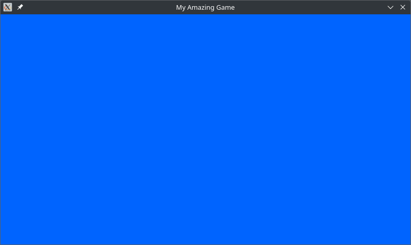

# Welcome to Realms - the lightweight Rust game library!

Realms is a library that allows you to easily make games, animations and any 2D graphics using Rust.

This is a 'mid-level' crate which provides an extremely simple API to easily draw to a graphical window, without being bloated like a typical game *engine*. Realms is a **game library**.

## Getting started

First, create a new project with `cargo new <project_name>`.

Next, import Realms into your Rust project by adding the following line to your **Cargo.toml**, under `[dependencies]`:

``` toml
realms = "VERSION_NUMBER"
```

Replace `VERSION_NUMBER` with the latest Realms version (displayed above). Alternatively, run this command in your terminal from inside your project directory:

``` sh
cargo new project_name
```

Replace `project_name` with the name of the game you want to create.

Finally, add this code to the `src/main.rs` file:

``` rust
use realms::event::Event;
use realms::window::Window
use realms::Colour;

fn main()
{
  let mut window = Window::new("My Amazing Game", 800, 450).unwrap();  // Create a new `Window`. For now, we won't worry about error handling.
  let fill_colour = Colour::from_rgb(0, 100, 255);  // Stores the background colour of the window.
  let mut running = true;  // Keep looping until this is `false`.

  while running
  {
    window.fill(fill_colour.clone()).unwrap();  // Copy the fill_colour so we can use it again on the next iteration.
    for event in window.get_events()
    {
      match event
      {
        Event::Quit => {
          running = false;  // Stop the loop if the user closes the program.
        },
        _ => {  }  // Default, do nothing if the event doesn't match.
      }
    }
    window.draw();  // Draw the frame.
  }
}
```

Running this code using `cargo run` will give you this result:



Congratulations! You have successfully written your first Realms game :\)

> Note: For more info, please see the full explanation at [github.com/dylanopen/realms](https://github.com/dylanopen/realms/tree/master/docs/examples/1-TheWindow.md)

## Example: Shapes and events

So far, we've just filled the background colour. What if we wanted to draw some shapes?

In this example, we will build a program where a rectangle follows your mouse pointer on the screen.

Copy this code into your `main.rs` file:

``` rust
use realms::event::Event;
use realms::shape::Rect;
use realms::window::Window;
use realms::Colour;

fn main()
{
  let mut window = Window::new("Shapes and events", 800, 600).unwrap();
  let mut running = true;

  let mut mouse_x = 400;  // Rectangle starting position.
  let mut mouse_y = 600;  // Must be mutable so we can update it.
  
  while running
  {
    window.fill(Colour::from_rgb(255, 255, 255)).unwrap();  // white
    for event in window.get_events()
    {
      match event
      {
        Event::Quit => {
          running = false;
        },
        Event::MouseMotion(event) => {
          mouse_x = event.x;  // Update mouse position.
          mouse_y = event.y;  // `event` is a MouseMotionEvent struct: it also holds the current mouse position.
        },
        _ => {  }
      }
    }
    let rect = Rect::new(
      mouse_x-16, mouse_y-16,  // The coordinates represent the top-left of the rect. Subtracting 16 ensures the rectangle's centre is at the mouse position.
      32, 32,
      Colour::from_rgb(255, 100, 0)  // orange
    );
    rect.draw(&mut window).unwrap();  // Draw the rectangle to the window. Realms uses `object.draw(&mut window)` notation.
    window.draw();
  }
}
```

Run the program and you should see an orange rectangle follow the cursor!

> Note: For more info, please see the full explanation at [github.com/dylanopen/realms](https://github.com/dylanopen/realms/tree/master/docs/examples/2-ShapesAndEvents.md)

## Documentation

The above examples are just a very brief introduction to the Realms library.

Please view [the documentation on GitHub](https://github.com/dylanopen/realms-rs/tree/master/docs). There is also some information available at [docs.rs](https://docs.rs/realms), although documentation there is limited.

Thank you for choosing Realms to build your next great game!
